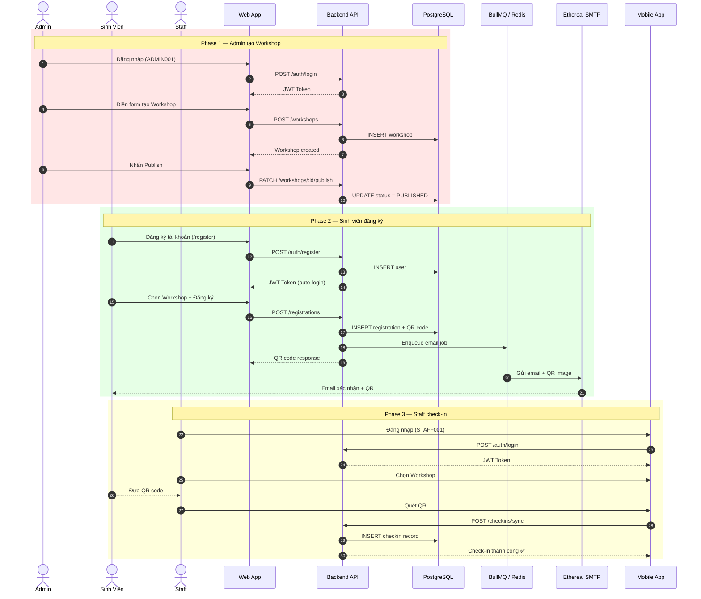
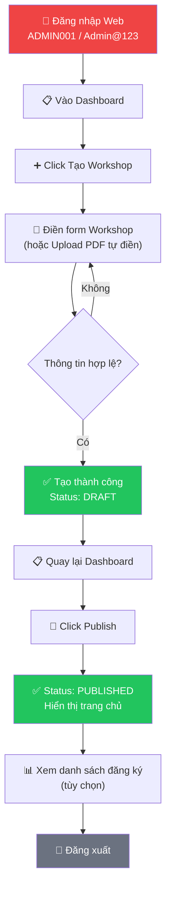
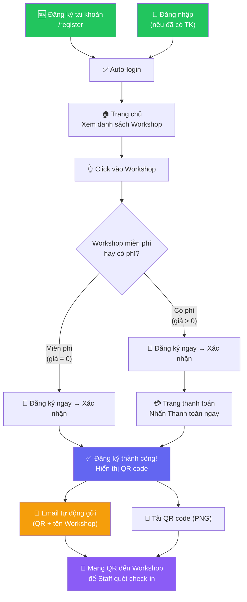
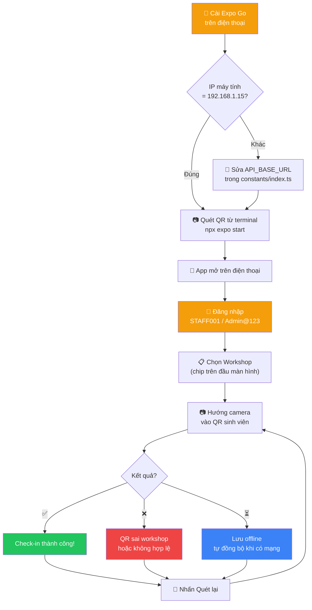
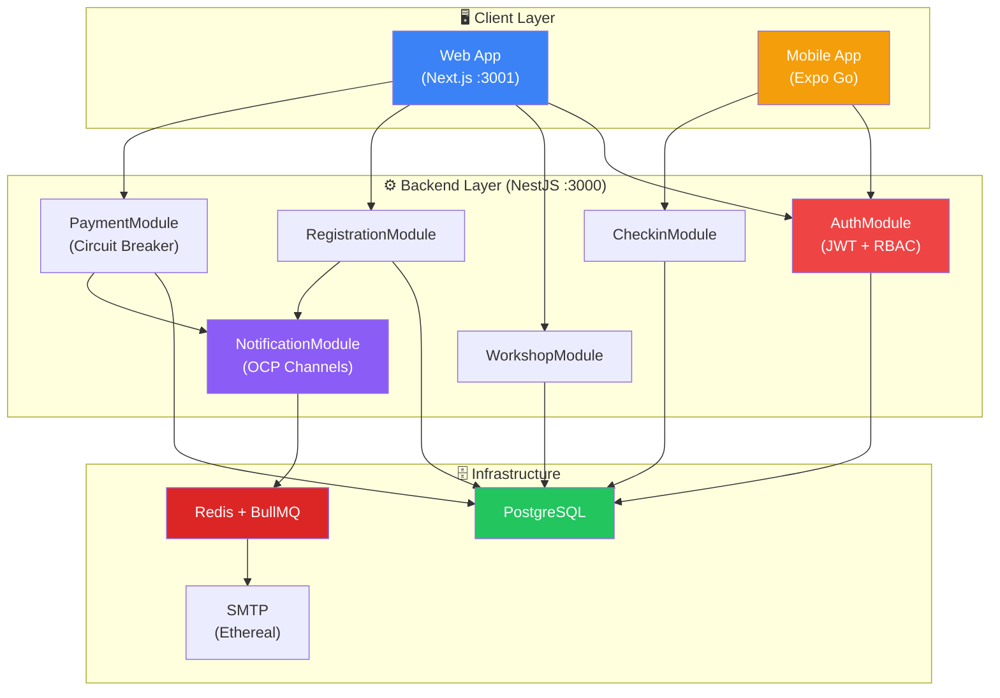
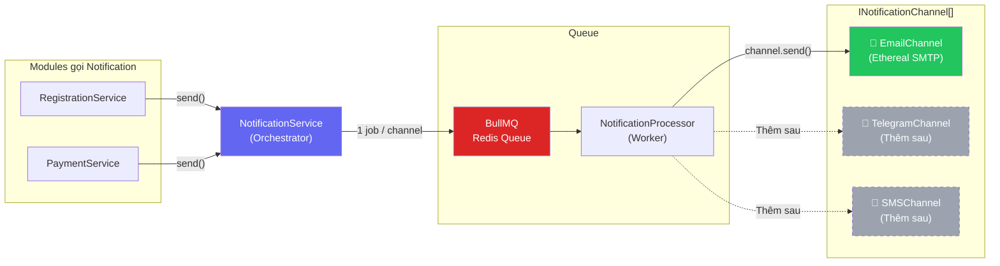
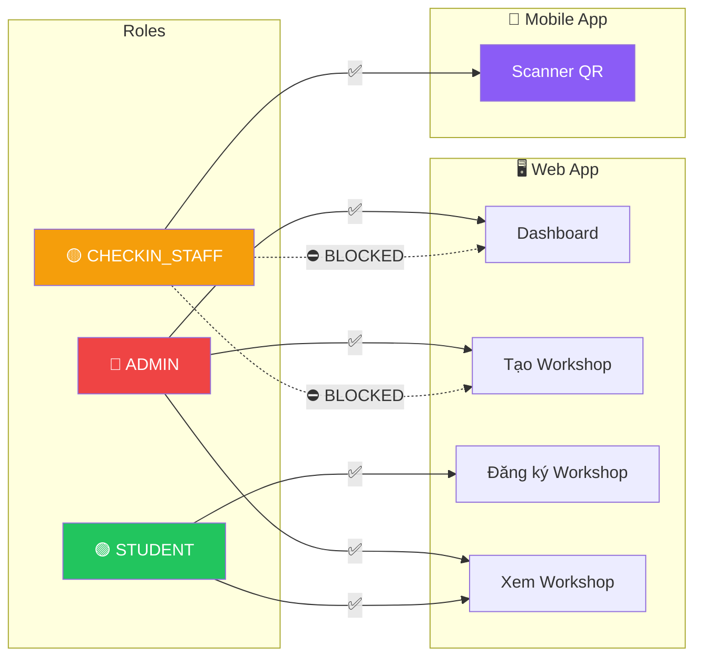

# 📖 Hướng dẫn sử dụng UniHub Workshop — Theo từng Role

> **Lưu ý:** Đảm bảo backend, web và database đã chạy trước khi bắt đầu.
>
> ```bash
> # Terminal 1: Infrastructure
> cd infra && docker compose --env-file .env up -d
>
> # Terminal 2: Backend
> cd src/backend && npm run start:dev
>
> # Terminal 3: Web
> cd src/web && npm run dev
>
> # Terminal 4: Mobile (nếu test Staff quét QR)
> cd src/mobile && npx expo start
> ```

---

## 📊 Tổng quan Workflow — Sơ đồ toàn bộ hệ thống



---

## 🔴 ROLE: ADMIN (Quản trị viên)

**Tài khoản:** `ADMIN001` / `Admin@123`  
**Truy cập:** Web — http://localhost:3001

### Sơ đồ luồng Admin



### Bước 1 — Đăng nhập

1. Mở trình duyệt → http://localhost:3001/login
2. Nhập MSSV: `ADMIN001`
3. Nhập mật khẩu: `Admin@123`
4. Nhấn **"Đăng nhập"**
5. ✅ Chuyển về trang chủ, navbar hiển thị **"Nguyen Van Admin"** cùng link **Dashboard**

### Bước 2 — Tạo Workshop mới

1. Click **"Dashboard"** trên navbar
2. Click **"+ Tạo Workshop"**
3. Điền thông tin:

| Trường | Ví dụ |
|--------|-------|
| Tiêu đề | Workshop Kỹ năng Thuyết trình |
| Mô tả | Học cách trình bày ý tưởng chuyên nghiệp |
| Diễn giả | ThS. Nguyễn Văn A |
| Phòng | A.301 |
| Thời gian bắt đầu | 2026-05-20 08:30 |
| Thời gian kết thúc | 2026-05-20 11:30 |
| Số chỗ ngồi | 50 |
| Giá vé (VND) | 0 *(miễn phí)* hoặc 50000 *(có phí)* |

4. *(Tùy chọn)* Upload file PDF ở phần trên form → hệ thống tự điền các trường
5. Nhấn **"Tạo Workshop"**
6. ✅ Thông báo thành công

### Bước 3 — Publish Workshop (mở đăng ký)

1. Quay lại **Dashboard** (click link trên navbar)
2. Tìm workshop vừa tạo trong danh sách
3. Nhấn nút **"Publish"** trên card workshop đó
4. ✅ Status chuyển thành **PUBLISHED**, workshop hiển thị trên trang chủ

### Bước 4 — Xem danh sách đăng ký (tùy chọn)

1. Trên Dashboard, click vào workshop
2. Xem danh sách sinh viên đã đăng ký, trạng thái, thống kê

### Bước 5 — Đăng xuất

1. Click **"Đăng xuất"** trên navbar

---

## 🟢 ROLE: SINH VIÊN (Student)

**Tài khoản:** Tự đăng ký mới hoặc dùng `SV001` / `Admin@123`  
**Truy cập:** Web — http://localhost:3001

### Sơ đồ luồng Sinh viên



### Bước 1 — Đăng ký tài khoản (lần đầu)

1. Mở trình duyệt → http://localhost:3001/register
2. Điền thông tin:

| Trường | Ví dụ | Ghi chú |
|--------|-------|---------|
| MSSV | *(để trống)* | Hệ thống tự tạo SV003, SV004... |
| Họ và tên | Lê Thị C | Bắt buộc |
| Email | lethic@student.edu.vn | Bắt buộc |
| Mật khẩu | Test@123 | Tối thiểu 6 ký tự |
| Xác nhận mật khẩu | Test@123 | Phải trùng khớp |

3. Nhấn **"Đăng ký"**
4. ✅ Đăng ký thành công → tự động đăng nhập → chuyển về trang chủ

### Bước 2 — Đăng nhập (nếu đã có tài khoản)

1. Mở http://localhost:3001/login
2. Nhập MSSV và mật khẩu
3. Nhấn **"Đăng nhập"**

### Bước 3 — Xem danh sách Workshop

1. Tại trang chủ, xem tất cả workshop đang mở đăng ký
2. Mỗi card hiển thị: tên, diễn giả, thời gian, phòng, giá, số chỗ còn lại

### Bước 4 — Đăng ký Workshop

#### 4a. Workshop miễn phí (giá = 0)

1. Click vào card workshop muốn đăng ký
2. Nhấn **"Đăng ký ngay"**
3. Nhấn **"Xác nhận đăng ký"**
4. ✅ Đăng ký thành công!
5. Màn hình hiển thị **QR code** (hình ảnh) + nút **"Tải QR code"**

#### 4b. Workshop có phí (giá > 0)

1. Click vào card workshop muốn đăng ký
2. Nhấn **"Đăng ký ngay"**
3. Nhấn **"Xác nhận đăng ký"**
4. Hệ thống chuyển sang trang thanh toán
5. Nhấn **"Thanh toán ngay"** *(hệ thống mock, tự động thành công)*
6. ✅ Thanh toán thành công! QR code hiển thị

### Bước 5 — Nhận Email xác nhận

Sau khi đăng ký/thanh toán thành công, hệ thống **tự động gửi email** chứa:

- ✅ Tên workshop đã đăng ký
- 📌 Badge tên workshop nổi bật
- 📱 **Hình ảnh QR code** để staff quét check-in
- 📎 File đính kèm `qr-checkin.png`

**Cách xem email (Ethereal — test SMTP):**

1. Mở trình duyệt → https://ethereal.email/login
2. Đăng nhập:
   - Email: `jpftzldlraidtdb5@ethereal.email`
   - Password: `yFSuBZCy1ryPhndDPC`
3. Click **"Messages"** trên menu
4. Tìm email mới nhất có tiêu đề **"✅ Đăng ký thành công: [Tên workshop]"**
5. Click để xem nội dung + QR code

> ⚠️ **Ethereal là SMTP test** — email không gửi đến hộp thư Gmail/Outlook thật.
> Chỉ xem được trên https://ethereal.email sau khi đăng nhập.

### Bước 6 — Lưu QR code

- **Trên web:** Nhấn nút **"Tải QR code"** → tải file PNG về máy
- **Từ email:** Mở email trên Ethereal → chuột phải vào QR → "Save image as..."
- Mang QR code này đến workshop để nhân viên quét xác nhận

---

## 🟡 ROLE: STAFF (Nhân viên Check-in)

**Tài khoản:** `STAFF001` / `Admin@123`  
**Truy cập:** Chỉ dùng **Mobile App** (Expo Go trên điện thoại thật)

> ⛔ Staff **KHÔNG** đăng nhập được trên web.
> Nếu thử đăng nhập trên web sẽ thấy lỗi:
> *"Tài khoản Staff chỉ được sử dụng trên ứng dụng mobile để quét QR."*

### Sơ đồ luồng Staff



### Điều kiện tiên quyết

- ✅ Điện thoại Android hoặc iOS
- ✅ Cài app **Expo Go** từ Google Play / App Store
- ✅ Điện thoại và máy tính **cùng mạng WiFi**
- ✅ Backend đang chạy (`npm run start:dev`)
- ✅ Expo đang chạy (`npx expo start`)

### Bước 1 — Kiểm tra IP máy tính

```powershell
ipconfig | Select-String "IPv4"
```

Nếu IP **khác** `192.168.1.15`, sửa file `src/mobile/src/constants/index.ts`:

```typescript
export const API_BASE_URL = 'http://<IP_CỦA_BẠN>:3000/api';
```

### Bước 2 — Mở app trên điện thoại

1. Mở terminal → chạy `npx expo start` trong thư mục `src/mobile`
2. Terminal hiển thị QR code
3. **Android:** Mở app Expo Go → quét QR
4. **iOS:** Mở Camera → quét QR → tự mở Expo Go

### Bước 3 — Đăng nhập Staff

1. App hiện màn hình đăng nhập
2. Nhập mã nhân viên: `STAFF001`
3. Nhập mật khẩu: `Admin@123`
4. Nhấn **"Đăng nhập"**
5. ✅ Chuyển sang màn hình Scanner

### Bước 4 — Chọn Workshop

1. Trên đầu màn hình, thấy danh sách workshop dạng **chip** (thanh ngang cuộn được)
2. Nhấn vào workshop cần check-in (VD: "Kỹ năng CV")
3. Workshop được chọn sáng màu tím

### Bước 5 — Quét QR sinh viên

1. Hướng camera điện thoại vào **QR code của sinh viên**
   - QR từ web (trang đăng ký thành công)
   - QR từ email (hình trong email xác nhận)
   - QR từ file PNG đã tải về
2. Camera tự động nhận diện QR
3. Kết quả hiển thị:

| Kết quả | Ý nghĩa |
|---------|---------|
| ✅ Check-in thành công! | Sinh viên đã được xác nhận tham gia |
| ❌ QR này không thuộc workshop đang chọn! | QR của workshop khác — chọn đúng workshop |
| ❌ QR code không hợp lệ! | QR không phải của hệ thống UniHub |
| ⏳ Đã lưu offline — chờ đồng bộ | Mất mạng — dữ liệu lưu local, tự đồng bộ khi có mạng |

### Bước 6 — Quét tiếp

1. Nhấn **"🔄 Quét lại"** để quét sinh viên tiếp theo
2. Lặp lại bước 5

### Bước 7 — Đăng xuất

1. Nhấn **"Đăng xuất"** (góc trên bên trái)

---

## 🏗️ Kiến trúc hệ thống



---

## 🔔 Hệ thống Notification — OCP Design



> **OCP:** Thêm kênh mới (Telegram, SMS) chỉ cần tạo 1 class implement `INotificationChannel` rồi đăng ký vào DI — **không sửa** NotificationService.

---

## 🔐 Phân quyền truy cập (RBAC)



---

## 🔑 Tài khoản Test

| Role | MSSV | Mật khẩu | Ghi chú |
|------|------|----------|---------|
| Admin | ADMIN001 | Admin@123 | Quản trị, tạo workshop |
| Sinh viên | SV001 | Admin@123 | Tài khoản mẫu có sẵn |
| Staff | STAFF001 | Admin@123 | Chỉ dùng mobile app |
| Sinh viên mới | *(tự đăng ký)* | *(tự chọn)* | Đăng ký tại /register |

---

## ❓ Xử lý lỗi thường gặp

| Lỗi | Nguyên nhân | Cách xử lý |
|-----|------------|------------|
| "Đã có lỗi xảy ra" khi đăng nhập | Sai MSSV hoặc mật khẩu | Kiểm tra lại thông tin |
| Staff không đăng nhập được web | Đúng thiết kế — Staff chỉ dùng mobile | Dùng Expo Go trên điện thoại |
| Mobile "Network request failed" | IP sai hoặc backend chưa chạy | Kiểm tra IP trong `constants/index.ts`, đảm bảo cùng WiFi |
| QR quét không ra | Ánh sáng yếu hoặc QR mờ | Zoom to QR, đảm bảo ánh sáng đủ |
| Email không thấy | Ethereal là SMTP test | Xem tại https://ethereal.email/login |
| Workshop không hiện trang chủ | Chưa Publish | Admin vào Dashboard → nhấn Publish |
