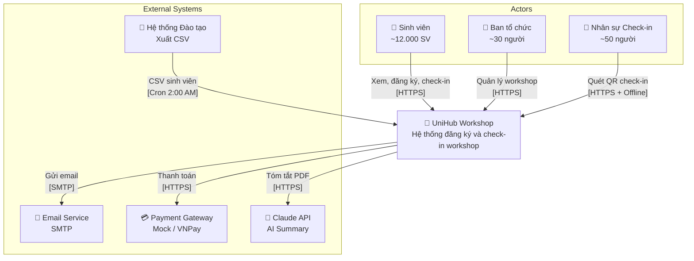
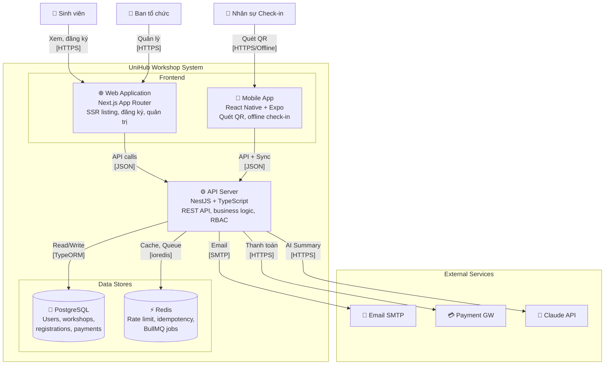
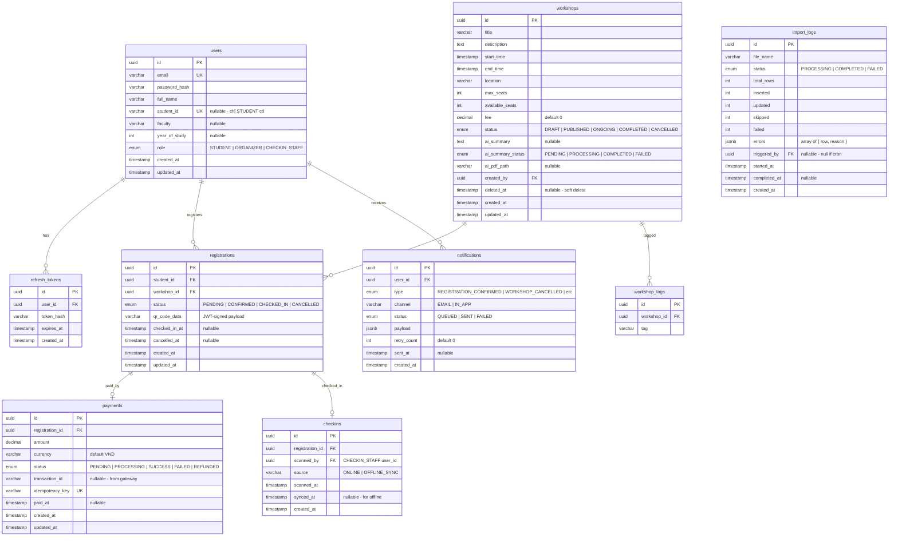
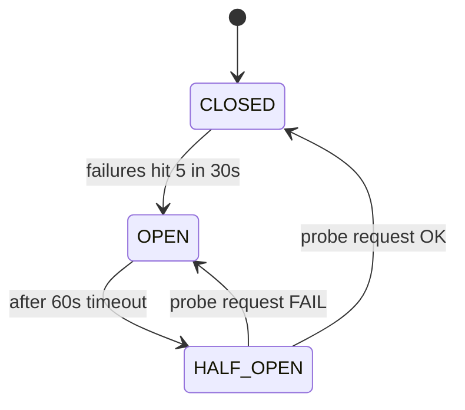
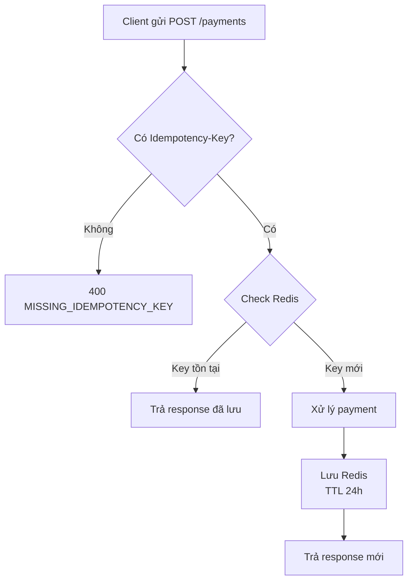
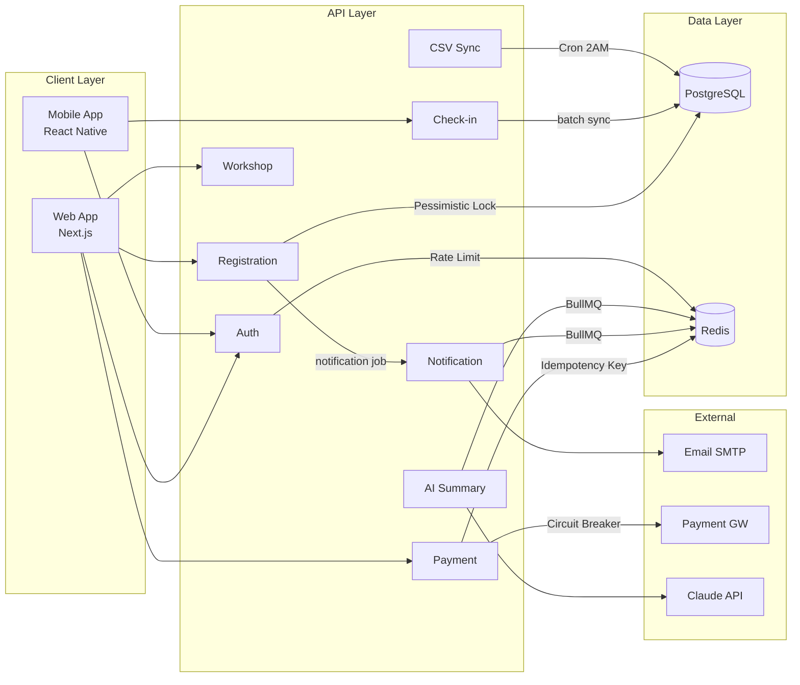

# UniHub Workshop — System Design Document

> **Version**: 1.0  
> **Ngày**: 2026-04-22  
> **Trạng thái**: Draft — chờ review

---

## 1. C4 Diagram

### 1.1 System Context Diagram (Level 1)

Nhìn tổng quan UniHub Workshop trong bối cảnh các hệ thống và người dùng bên ngoài.



### 1.2 Container Diagram (Level 2)

Chi tiết các container (ứng dụng/service) bên trong hệ thống UniHub Workshop.



---

## 2. Database Schema

### 2.1 Entity Relationship Diagram



### 2.2 Bảng tóm tắt

| Bảng             | Mục đích                    | Index quan trọng                                |
| ---------------- | --------------------------- | ----------------------------------------------- |
| `users`          | Thông tin người dùng + auth | `email` (UNIQUE), `student_id` (UNIQUE), `role` |
| `refresh_tokens` | Lưu refresh token hash      | `user_id`, `token_hash`                         |
| `workshops`      | Thông tin workshop          | `status`, `start_time`, `deleted_at`            |
| `workshop_tags`  | Tags cho workshop           | `workshop_id`, `tag`                            |
| `registrations`  | Đăng ký chỗ ngồi            | `(student_id, workshop_id)` UNIQUE, `status`    |
| `payments`       | Giao dịch thanh toán        | `registration_id`, `idempotency_key` (UNIQUE)   |
| `checkins`       | Lịch sử check-in            | `registration_id`                               |
| `notifications`  | Queue thông báo             | `user_id`, `status`                             |
| `import_logs`    | Log import CSV              | `status`, `created_at`                          |

### 2.3 Ghi chú thiết kế

- **UUID** cho tất cả primary key (tránh sequential ID leak)
- **snake_case** cho tên bảng và cột
- **Mọi bảng** có `created_at`, `updated_at` (trừ bảng join)
- **Soft delete** cho `workshops` (cột `deleted_at`)
- **UNIQUE constraint** `(student_id, workshop_id)` trong `registrations` — chống đăng ký trùng ở DB level
- **UNIQUE constraint** `idempotency_key` trong `payments` — chống double charge ở DB level

---

## 3. Architecture Decision Records (ADRs)

### ADR-001: Pessimistic Lock cho Seat Reservation

**Trạng thái:** ✅ Accepted

**Bối cảnh:**  
~12.000 sinh viên có thể đăng ký workshop cùng lúc. Workshop phổ biến (100–300 chỗ) sẽ đầy rất nhanh. Cần đảm bảo:

- Không oversell (availableSeats không bao giờ < 0)
- Không race condition giữa các request đồng thời
- Consistency > performance

**Quyết định:**  
Sử dụng **Pessimistic Locking** (`SELECT ... FOR UPDATE`) trong database transaction.

**Cơ chế hoạt động:**

```
1. BEGIN TRANSACTION
2. SELECT * FROM workshops WHERE id = :id FOR UPDATE
   → Row bị lock, các transaction khác phải chờ
3. Kiểm tra available_seats > 0
4. UPDATE workshops SET available_seats = available_seats - 1
5. INSERT INTO registrations (...)
6. COMMIT → giải phóng lock
```

**Tại sao không dùng Optimistic Lock?**

| Tiêu chí          | Pessimistic Lock             | Optimistic Lock                    |
| ----------------- | ---------------------------- | ---------------------------------- |
| Conflict rate cao | ✅ Phù hợp — lock trước      | ❌ Retry liên tục, performance kém |
| Data consistency  | ✅ Guaranteed                | ⚠️ Cần retry logic phức tạp        |
| Complexity        | Đơn giản (1 transaction)     | Phức tạp (version check + retry)   |
| Deadlock risk     | ⚠️ Có — nhưng kiểm soát được | ✅ Không deadlock                  |

**Kết luận:** Với workshop 100–300 chỗ và hàng trăm request đồng thời, **conflict rate cao** → Pessimistic Lock là lựa chọn đúng. Deadlock được giảm thiểu bằng:

- Luôn lock theo thứ tự `workshop_id` (tránh cross-table deadlock)
- Transaction ngắn nhất có thể (chỉ chứa logic cần thiết)
- Retry 1 lần nếu gặp deadlock

**Hệ quả:**

- Throughput thấp hơn optimistic lock khi conflict rate thấp
- Cần monitoring deadlock qua PostgreSQL `pg_stat_activity`

---

### ADR-002: Token Bucket Rate Limiting

**Trạng thái:** ✅ Accepted

**Bối cảnh:**  
12.000 sinh viên truy cập đồng thời khi mở đăng ký workshop hot. Cần:

- Bảo vệ server khỏi overload
- Chống bot/spam đăng ký
- Không ảnh hưởng người dùng bình thường

**Quyết định:**  
Sử dụng **Token Bucket Algorithm** implement bằng Redis.

**Cơ chế hoạt động:**

```
Mỗi client (IP) có 1 bucket:
- Bucket chứa N tokens
- Mỗi request tiêu tốn 1 token
- Tokens được refill đều đặn theo thời gian
- Khi hết token → reject request (429 Too Many Requests)

Redis structure:
  key:   rate_limit:{ip}:{endpoint}
  value: { tokens: number, lastRefill: timestamp }
  TTL:   window_size_seconds (auto cleanup)
```

**Cấu hình cụ thể:**

| Endpoint              | Max Requests | Window | Lý do                       |
| --------------------- | ------------ | ------ | --------------------------- |
| `POST /registrations` | 10           | 1 phút | Chống spam đăng ký          |
| `GET /workshops`      | 100          | 1 phút | Cho phép browse bình thường |
| `POST /auth/login`    | 5            | 1 phút | Chống brute force           |
| `POST /payments`      | 5            | 1 phút | Chống double charge attempt |

**Tại sao Token Bucket, không phải Fixed Window / Sliding Window?**

| Algorithm          | Burst handling            | Memory                  | Complexity   |
| ------------------ | ------------------------- | ----------------------- | ------------ |
| Fixed Window       | ❌ 2x burst ở biên window | Thấp                    | Đơn giản     |
| Sliding Window Log | ✅ Chính xác              | Cao (lưu mọi request)   | Phức tạp     |
| **Token Bucket**   | ✅ Cho phép burst hợp lý  | **Thấp (2 fields/key)** | **Vừa phải** |

**Kết luận:** Token Bucket cân bằng giữa tính chính xác và hiệu năng. Cho phép burst nhỏ (SV vào trang, click nhiều lần) mà vẫn giới hạn tổng thể.

**Hệ quả:**

- Response header `X-RateLimit-Remaining` cho client biết quota còn lại
- Rate limit per IP → cần xem xét thêm per user-id cho các endpoint auth
- Redis là single point of failure cho rate limiting → cần Redis Sentinel/Cluster trong production

---

### ADR-003: Circuit Breaker cho Payment Gateway

**Trạng thái:** ✅ Accepted

**Bối cảnh:**  
Payment gateway (VNPay, MoMo) là hệ thống bên ngoài, có thể lỗi/chậm bất kỳ lúc nào. Nếu gateway down mà server tiếp tục gửi request:

- Thread pool bị chiếm hết (waiting for timeout)
- Cascade failure: payment lỗi → kéo theo registration, workshop listing cũng chậm
- User experience tệ (chờ 30s rồi nhận lỗi)

**Quyết định:**  
Implement **Circuit Breaker Pattern** với 3 trạng thái.

**State Machine:**



**Cấu hình:**

| Parameter                | Giá trị | Lý do                                      |
| ------------------------ | ------- | ------------------------------------------ |
| `FAILURE_THRESHOLD`      | 5       | 5 lỗi liên tiếp = gateway có vấn đề        |
| `FAILURE_WINDOW`         | 30 giây | Lỗi phải tập trung, không đếm lỗi rải rác  |
| `OPEN_TIMEOUT`           | 60 giây | Cho gateway thời gian recover              |
| `HALF_OPEN_MAX_REQUESTS` | 1       | Chỉ thử 1 request, tránh flood khi chưa ổn |

**Behavior mỗi state:**

| State       | Request đến                         | Response                              |
| ----------- | ----------------------------------- | ------------------------------------- |
| `CLOSED`    | Forward bình thường                 | Response từ gateway                   |
| `OPEN`      | **Reject ngay** (không gọi gateway) | `503 { code: "PAYMENT_UNAVAILABLE" }` |
| `HALF_OPEN` | Cho 1 request thử                   | Success → CLOSED; Fail → OPEN         |

**Nguyên tắc cách ly:**  
Khi Circuit Breaker ở trạng thái OPEN:

- ❌ Payment bị block
- ✅ Workshop listing hoạt động bình thường
- ✅ Registration (miễn phí) hoạt động bình thường
- ✅ Check-in hoạt động bình thường
- ✅ Notification hoạt động bình thường

**Hệ quả:**

- Cần monitoring/alerting khi CB chuyển OPEN (Prometheus metric / log alert)
- Client cần handle 503 gracefully: "Thanh toán tạm thời không khả dụng, vui lòng thử lại sau"
- State lưu in-memory (single instance) hoặc Redis (multi-instance)

---

### ADR-004: Idempotency Key cho Payment

**Trạng thái:** ✅ Accepted

**Bối cảnh:**  
Trong thanh toán online, double charge có thể xảy ra khi:

- User click "Thanh toán" 2 lần (impatient click)
- Network timeout → client retry → server nhận 2 lần
- Mobile app retry tự động
- Browser refresh giữa chừng

Double charge = sinh viên bị trừ tiền 2 lần = **lỗi nghiêm trọng**.

**Quyết định:**  
Bắt buộc **Idempotency Key** (UUID v4) trong header cho mọi request POST /payments.

**Cơ chế hoạt động:**

```
Client → POST /payments
         Header: Idempotency-Key: 550e8400-e29b-41d4-a716-446655440000

Server:
1. Kiểm tra Redis: idempotency:550e8400-e29b-41d4-a716-446655440000
2. MISS (chưa xử lý):
   a. Xử lý payment
   b. Lưu Redis: { statusCode: 201, body: {...}, processedAt: "..." }
   c. TTL = 24 giờ
   d. Trả response cho client
3. HIT (đã xử lý):
   a. Đọc response đã lưu từ Redis
   b. Trả response đã lưu ngay lập tức
   c. KHÔNG gọi payment gateway lại
```

**Flow Diagram:**



**Redis storage:**

```
Key:   idempotency:{uuid}
Value: {
  "statusCode": 201,
  "body": { "success": true, "data": { "id": "...", "status": "PROCESSING" } },
  "processedAt": "2026-04-22T12:00:00Z"
}
TTL:   86400 (24 giờ)
```

**Tại sao Idempotency Key, không phải database unique constraint?**

| Approach             | Double request | Race condition                    | Response nhất quán    |
| -------------------- | -------------- | --------------------------------- | --------------------- |
| DB unique constraint | ✅ Chặn        | ⚠️ Có thể 1 thành công, 1 lỗi 409 | ❌ Response khác nhau |
| **Idempotency Key**  | ✅ Chặn        | ✅ Redis atomic check             | ✅ **Cùng response**  |

**Kết luận:** Idempotency Key đảm bảo client luôn nhận cùng response, bất kể gửi bao nhiêu lần. DB unique constraint chỉ chặn duplicate nhưng response khác nhau (lần đầu 201, lần sau 409) gây confusion.

**Hệ quả:**

- Client phải tự generate UUID v4 cho mỗi payment intent mới
- TTL 24h → sau 24h cùng Idempotency Key sẽ được xử lý lại (acceptable cho payment)
- Redis failure → fallback sang DB unique constraint (degraded mode)

---

## 4. Component Interaction Overview



---

## 5. Deployment Architecture (Phase 1 — Local Dev)

```
Docker Compose:
├── postgres:15      (port 5432)
├── redis:7          (port 6379)
├── api-server       (port 3000) — NestJS
├── web-app          (port 3001) — Next.js
└── mock-payment     (port 9999) — Simple mock server
```

Mobile app chạy trên Expo Dev Client, kết nối API server qua local network.

---

## 6. Security Considerations

| Concern           | Mitigation                                       |
| ----------------- | ------------------------------------------------ |
| SQL Injection     | TypeORM parameterized queries                    |
| XSS               | Next.js auto-escaping, CSP headers               |
| CSRF              | SameSite cookies, CORS whitelist                 |
| Brute force login | Rate limiting 5 req/min                          |
| Token theft       | Short-lived access token (15m), refresh rotation |
| QR forgery        | JWT-signed QR payload, server-side verify        |
| Secret leakage    | Env variables, never hardcode                    |
