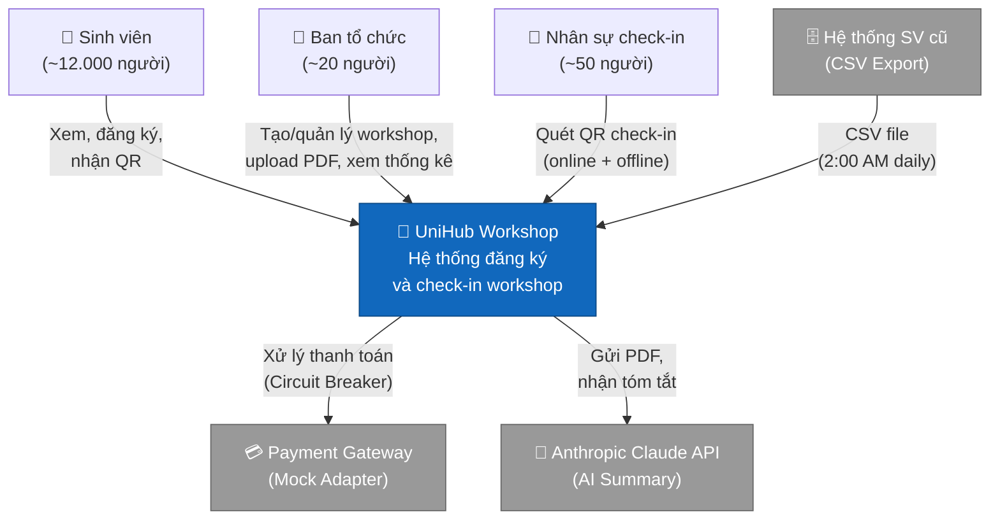
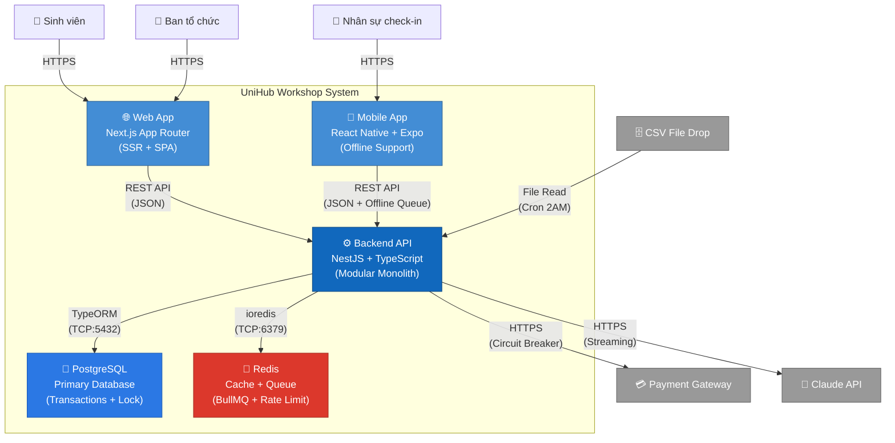
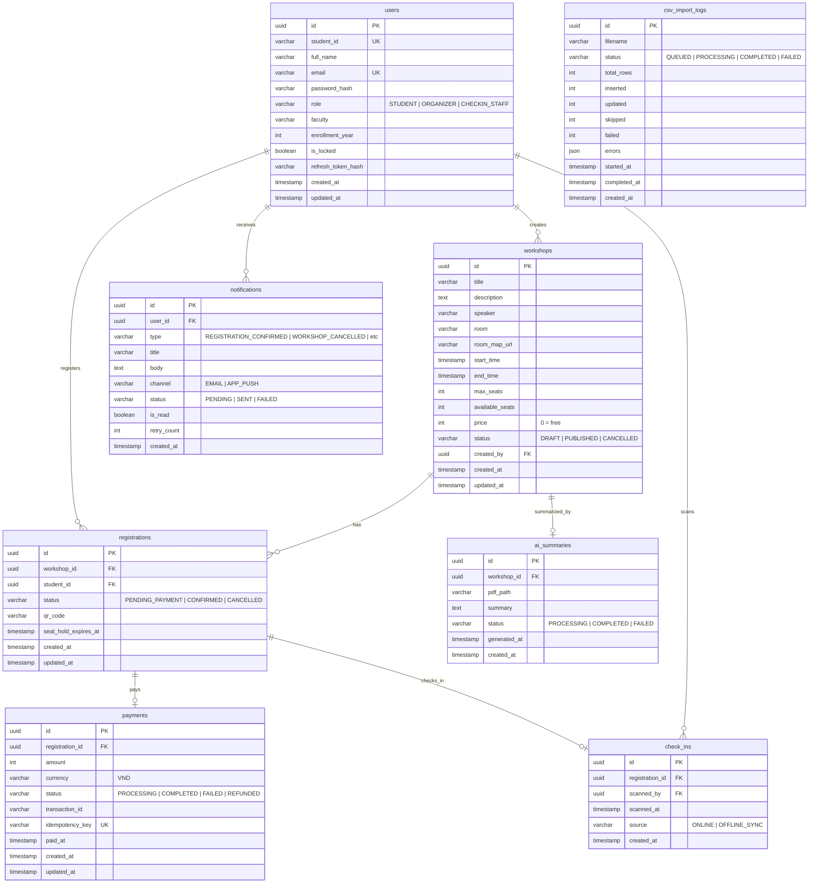
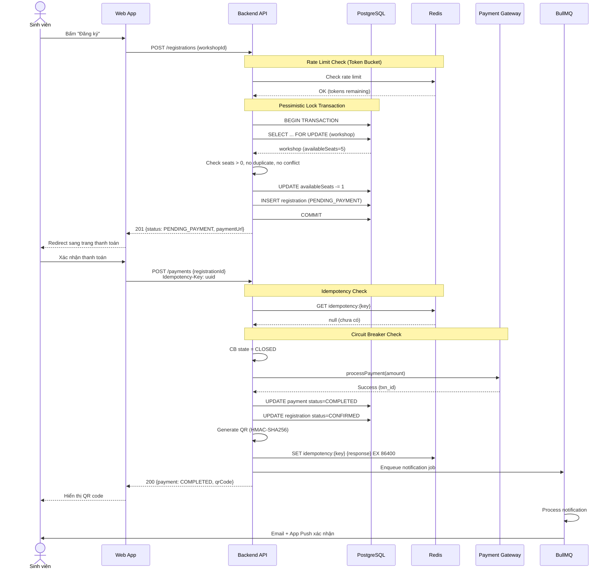
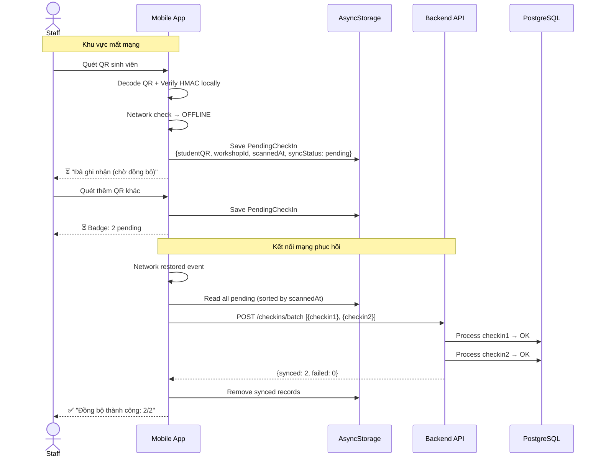
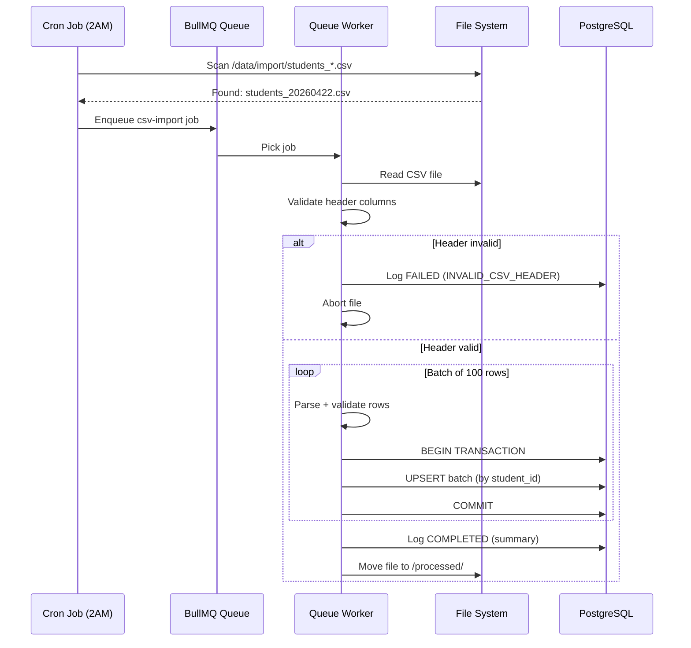

# UniHub Workshop — Technical Design

## Kiến trúc tổng thể

UniHub Workshop sử dụng kiến trúc **Modular Monolith** — một ứng dụng NestJS duy nhất được tổ chức thành các module tách biệt theo bounded context. Lựa chọn này phù hợp vì:

1. **Quy mô phù hợp**: ~12.000 users, 1 trường — chưa cần microservices.
2. **KISS**: Triển khai, debug, và vận hành đơn giản hơn microservices.
3. **Tách biệt rõ ràng**: Mỗi NestJS module = 1 bounded context, dễ tách ra microservice sau nếu cần.
4. **Transaction support**: Pessimistic Lock cần database transaction trong cùng process.

### Các thành phần chính

| Thành phần | Công nghệ | Vai trò |
|-----------|-----------|---------|
| Web App | Next.js (App Router) | SSR cho SV xem/đăng ký + Admin portal |
| Mobile App | React Native + Expo | Check-in QR + offline support |
| Backend API | NestJS + TypeScript | Business logic, REST API |
| Primary DB | PostgreSQL | Dữ liệu chính, transactions |
| Cache & Queue | Redis | Rate limiting, idempotency, BullMQ |
| AI Service | Anthropic Claude API | Tóm tắt PDF workshop |
| Payment | Mock Adapter | Interface thật, implementation giả lập |
| Legacy System | CSV Export | Dữ liệu sinh viên (one-way) |

### Giao tiếp giữa các thành phần

- **Web App ↔ Backend**: REST API qua HTTPS (JSON)
- **Mobile App ↔ Backend**: REST API qua HTTPS (JSON) + offline queue
- **Backend ↔ PostgreSQL**: TypeORM qua TCP
- **Backend ↔ Redis**: ioredis qua TCP (cache, rate limit, idempotency, BullMQ)
- **Backend → Claude API**: HTTPS REST (streaming response)
- **Backend → Payment Gateway**: HTTPS REST (qua Circuit Breaker)
- **Legacy System → Backend**: CSV file drop (cron read, one-way)

### Khi một phần gặp sự cố

| Sự cố | Ảnh hưởng | Cơ chế bảo vệ |
|-------|-----------|----------------|
| Payment Gateway down | Chỉ workshop có phí bị ảnh hưởng | Circuit Breaker cô lập |
| Redis down | Rate limiting, queue tạm ngưng | Graceful degradation, log warning |
| Claude API down | AI summary không tạo được | Retry queue, workshop vẫn hoạt động |
| PostgreSQL down | Toàn bộ hệ thống ngưng | Critical — cần monitoring |
| Mobile mất mạng | Check-in offline tiếp tục | AsyncStorage queue + sync |

---

## C4 Diagram

### Level 1 — System Context



### Level 2 — Container



---

## Thiết kế cơ sở dữ liệu

### Lựa chọn: PostgreSQL (SQL)

**Lý do:**
- Cần **ACID transactions** cho seat locking (Pessimistic Lock).
- Dữ liệu có quan hệ rõ ràng (users → registrations → workshops).
- `SELECT ... FOR UPDATE` là tính năng native của PostgreSQL.
- Hỗ trợ index, constraint, và query phức tạp cho reporting.

**Redis bổ sung cho:**
- Rate limiting counters (TTL-based).
- Idempotency key store (TTL 24h).
- BullMQ job queue.
- Không dùng Redis làm primary data store.

### ER Diagram



### Indexes quan trọng

```sql
-- Seat locking performance
CREATE INDEX idx_workshops_status ON workshops(status);
CREATE INDEX idx_workshops_start_time ON workshops(start_time);

-- Registration lookup
CREATE UNIQUE INDEX idx_registrations_workshop_student ON registrations(workshop_id, student_id);
CREATE INDEX idx_registrations_status ON registrations(status);
CREATE INDEX idx_registrations_seat_hold ON registrations(seat_hold_expires_at)
    WHERE status = 'PENDING_PAYMENT';

-- Payment idempotency
CREATE UNIQUE INDEX idx_payments_idempotency ON payments(idempotency_key);

-- Check-in dedup
CREATE UNIQUE INDEX idx_checkins_registration ON check_ins(registration_id);

-- Notification queue
CREATE INDEX idx_notifications_user_read ON notifications(user_id, is_read);
```

---

## Thiết kế kiểm soát truy cập (RBAC)

### Mô hình

Sử dụng **Role-Based Access Control** với 3 roles cố định. Mỗi role có tập permissions predefined. Kiểm tra quyền tại **2 điểm**:

1. **API Gateway level**: `JwtAuthGuard` verify token + extract role.
2. **Endpoint level**: `RolesGuard` + `@Roles()` decorator kiểm tra role có quyền.

### Permission Matrix

| Permission | STUDENT | ORGANIZER | CHECKIN_STAFF |
|-----------|---------|-----------|---------------|
| `workshop:read` | ✅ | ✅ | ❌ |
| `workshop:write` | ❌ | ✅ | ❌ |
| `registration:create` | ✅ | ✅ | ❌ |
| `registration:read:own` | ✅ | ✅ | ❌ |
| `registration:read:all` | ❌ | ✅ | ❌ |
| `payment:create` | ✅ | ❌ | ❌ |
| `checkin:scan` | ❌ | ❌ | ✅ |
| `checkin:self` | ✅ | ✅ | ❌ |
| `stats:read` | ❌ | ✅ | ❌ |
| `csv-sync:manage` | ❌ | ✅ | ❌ |
| `ai-summary:upload` | ❌ | ✅ | ❌ |

### Implementation

```
Guard chain: JwtAuthGuard → RolesGuard → Controller method

@UseGuards(JwtAuthGuard, RolesGuard)
@Roles('ORGANIZER')
@Post('workshops')
async createWorkshop(@Body() dto) { ... }
```

- JWT payload: `{ sub: userId, role: "STUDENT" | "ORGANIZER" | "CHECKIN_STAFF" }`
- Token verified stateless (không query DB mỗi request).
- Role stored trong `users.role` column, không dùng bảng riêng (KISS — chỉ 3 roles cố định).

---

## Các luồng nghiệp vụ quan trọng

### Luồng 1 — Đăng ký workshop có phí (end-to-end)



### Luồng 2 — Check-in offline và đồng bộ



### Luồng 3 — Import CSV đêm



---

## Thiết kế các cơ chế bảo vệ hệ thống

### Kiểm soát tải đột biến — Token Bucket Rate Limiting

**Vấn đề:** 12.000 SV truy cập trong 10 phút đầu, 60% dồn vào 3 phút → ~120 req/s peak.

**Giải pháp:** Token Bucket algorithm trên Redis.

**Cách hoạt động:**
- Mỗi IP + endpoint có 1 bucket chứa tokens.
- Mỗi request tiêu 1 token.
- Tokens được refill đều đặn theo rate cố định.
- Hết token → reject `429 TOO_MANY_REQUESTS`.

**Cấu hình:**

| Endpoint | Max Tokens | Refill Rate |
|----------|-----------|-------------|
| `POST /registrations` | 10 | 10 tokens/phút |
| `GET /workshops` | 100 | 100 tokens/phút |
| `POST /payments` | 5 | 5 tokens/phút |
| Tất cả endpoints khác | 60 | 60 tokens/phút |

**Redis key format:**
```
rate_limit:{ip}:{endpoint}
value: { tokens: number, lastRefill: timestamp }
TTL: window_size_seconds
```

**Tại sao Token Bucket (không phải Fixed Window / Sliding Window):**
- Cho phép **burst** ngắn (SV bấm nhanh vài lần) nhưng giới hạn sustained rate.
- Smooth hơn Fixed Window (không có edge-case đầu/cuối window).
- Đơn giản implement trên Redis (1 key per IP+endpoint).

---

### Xử lý cổng thanh toán không ổn định — Circuit Breaker

**Vấn đề:** Payment gateway có thể timeout hoặc lỗi liên tục, kéo sập toàn bộ hệ thống.

**Giải pháp:** Circuit Breaker pattern cô lập lỗi payment.

**Ba trạng thái:**

```
CLOSED ──(5 lỗi/30s)──▶ OPEN ──(60s timeout)──▶ HALF_OPEN
   ▲                                                  │
   └──────────(1 request thành công)──────────────────┘
                                    │
                        (1 request thất bại)
                                    │
                                    ▼
                                  OPEN
```

| Trạng thái | Hành vi |
|-----------|---------|
| **CLOSED** | Forward request bình thường. Đếm lỗi liên tiếp. |
| **OPEN** | Reject ngay `503 PAYMENT_UNAVAILABLE`. Không gọi gateway. |
| **HALF_OPEN** | Cho 1 request thử. Thành công → CLOSED. Lỗi → OPEN. |

**Cấu hình:**
- Threshold mở: **5 lỗi liên tiếp** trong **30 giây**.
- Reset timeout: **60 giây**.
- **Isolation**: Chỉ ảnh hưởng payment flow. Xem workshop, đăng ký miễn phí, check-in vẫn hoạt động bình thường.

---

### Chống trừ tiền hai lần — Idempotency Key

**Vấn đề:** Client retry payment khi timeout → nguy cơ trừ tiền 2 lần.

**Giải pháp:** Idempotency Key — mỗi request mang 1 unique key. Server nhận diện request trùng và trả cached response.

**Luồng xử lý:**

```
Client gửi: POST /payments + Header: Idempotency-Key: <uuid-v4>
    │
    ▼
Server check Redis: GET idempotency:{key}
    │
    ├── Đã có → Trả cached response (KHÔNG xử lý lại)
    │
    └── Chưa có → Xử lý payment
                    → Lưu response vào Redis: SET idempotency:{key} {response} EX 86400
                    → Trả response cho client
```

**Cấu hình:**
- Key format: UUID v4 (client generate).
- Storage: Redis.
- TTL: **24 giờ** (86400 seconds).
- Thiếu Idempotency Key header → `400 MISSING_IDEMPOTENCY_KEY`.

---

## Các quyết định kỹ thuật quan trọng (ADR)

### ADR-001: Pessimistic Lock cho Seat Locking

**Bối cảnh:** Workshop 60 chỗ, hàng trăm SV đăng ký cùng lúc. Cần đảm bảo zero over-booking.

**Quyết định:** Sử dụng Pessimistic Lock (`SELECT ... FOR UPDATE`) kết hợp database transaction.

**Lý do:**
- Đảm bảo **serializable** cho thao tác check + trừ chỗ ngồi.
- Đơn giản, dễ hiểu (KISS) — PostgreSQL native support.
- Phù hợp với write-heavy, high-contention scenario.

**Đánh đổi:**
- Lock giữ connection → có thể bottleneck nếu transaction kéo dài.
- Mitigation: transaction chỉ chứa logic tối thiểu (check seats → trừ seats → insert registration), không gọi external service trong transaction.

**Tại sao không dùng Optimistic Lock:**
- High contention (nhiều SV cùng đăng ký 1 workshop) → retry rate cao → UX kém.
- Pessimistic Lock đảm bảo first-come-first-served rõ ràng hơn.

---

### ADR-002: Token Bucket cho Rate Limiting

**Bối cảnh:** 12.000 SV, 60% dồn vào 3 phút đầu (~120 req/s). Cần bảo vệ backend.

**Quyết định:** Token Bucket algorithm, implement trên Redis.

**Lý do:**
- Cho phép burst ngắn hạn (SV bấm nhanh 2–3 lần) nhưng giới hạn sustained rate.
- Smooth hơn Fixed Window (tránh vấn đề edge-of-window).
- Redis là single source of truth cho token count → hoạt động đúng cả khi scale ngang.

**Đánh đổi:**
- Phụ thuộc Redis — nếu Redis down, rate limiting không hoạt động.
- Mitigation: fallback cho phép request khi Redis down (fail-open), kèm monitoring alert.

---

### ADR-003: Circuit Breaker cho Payment Gateway

**Bối cảnh:** Payment gateway có thể lỗi liên tục. Không được để payment lỗi kéo sập hệ thống.

**Quyết định:** Implement Circuit Breaker pattern (CLOSED → OPEN → HALF_OPEN).

**Lý do:**
- **Fault isolation**: Payment lỗi không ảnh hưởng workshop listing, đăng ký miễn phí, check-in.
- **Fail fast**: Khi biết gateway down, reject ngay thay vì đợi timeout (giảm latency, tiết kiệm resource).
- **Self-healing**: Tự thử lại sau 60s, tự phục hồi khi gateway hoạt động lại.

**Đánh đổi:**
- SV không thanh toán được khi CB OPEN → UX giảm cho workshop có phí.
- Mitigation: hiển thị thông báo rõ ràng "Hệ thống thanh toán tạm thời gián đoạn, vui lòng thử lại sau", giữ seat hold.

---

### ADR-004: Idempotency Key cho Payment

**Bối cảnh:** Client retry payment khi network timeout → nguy cơ double charge.

**Quyết định:** Bắt buộc `Idempotency-Key` header (UUID v4) cho mọi payment request. Server lưu response vào Redis (TTL 24h) và replay khi gặp key trùng.

**Lý do:**
- **Chống double charge** một cách deterministic — không phụ thuộc vào timing hay race condition.
- Stateless check (Redis lookup < 10ms) — không ảnh hưởng performance.
- Client-generated key → client kiểm soát retry behavior.

**Đánh đổi:**
- Phụ thuộc Redis cho dedup — nếu Redis mất data trước TTL hết, có thể xử lý trùng.
- Mitigation: TTL 24h đủ dài cho mọi retry scenario thực tế. Redis persistence (RDB + AOF) bảo vệ khỏi restart.
- Thêm database unique constraint trên `idempotency_key` làm safety net cuối cùng.
